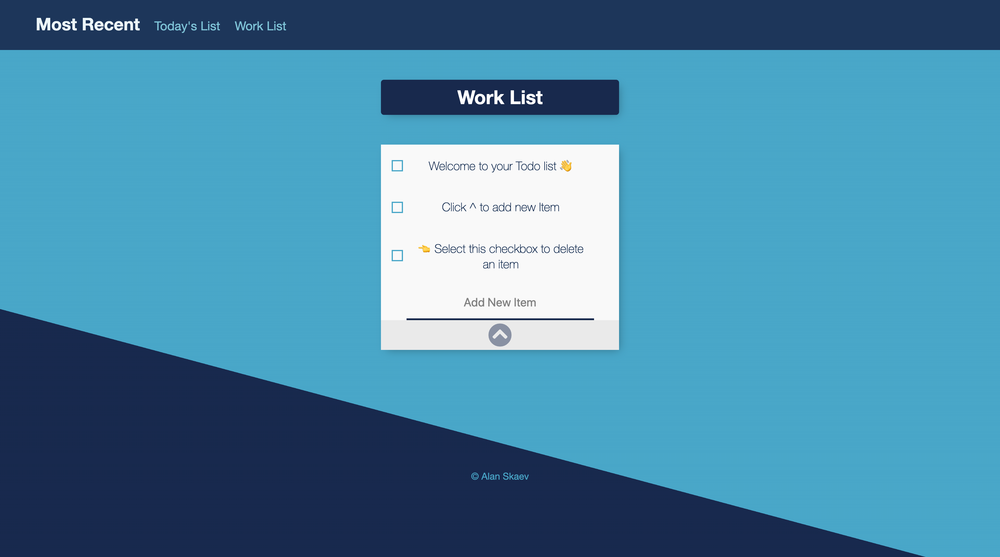

# Todo-List-JS
Responsive Todo List App

Built with 
* Node.js + Express
* Bootstrap
* MongoDB + Mongoose

Hosted on heroku & mongo atlas.

To create or access previosuly created list, add list name to url parameters, for example:

[https://todo-alanskaev.herokuapp.com/Work](https://todo-alanskaev.herokuapp.com/Work)

# Screenshot

